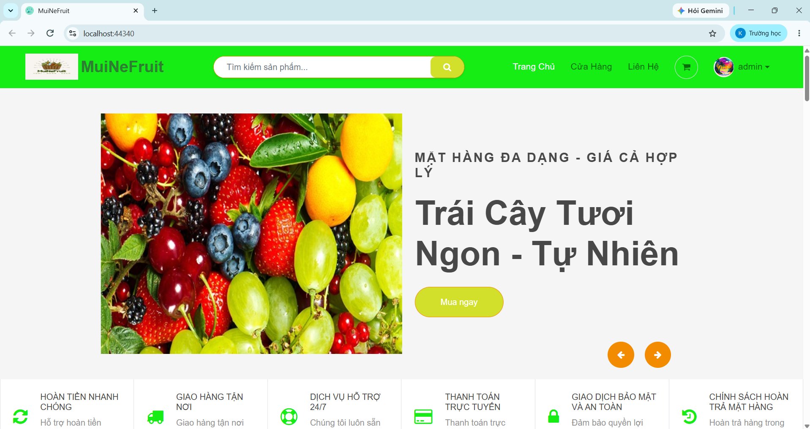
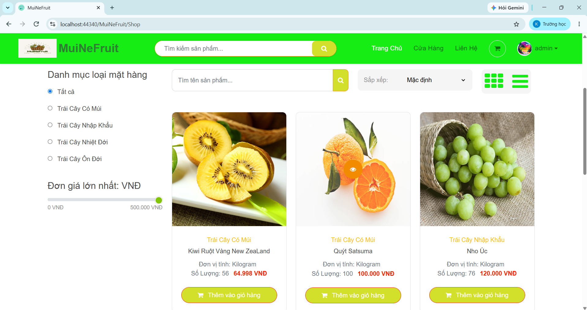
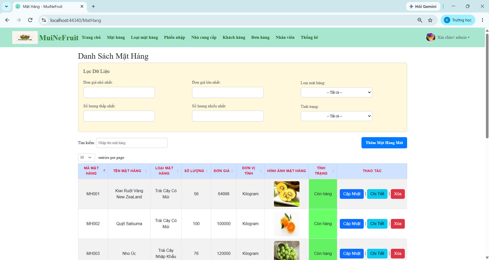
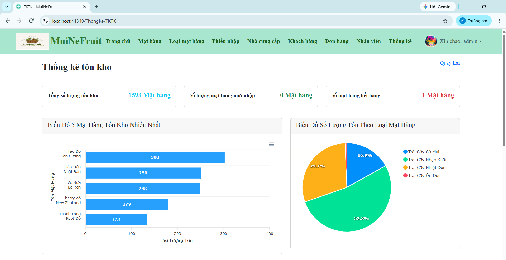

# Web Bán Trái Cây Online

Website bán trái cây trực tuyến kết hợp hệ thống quản lý dành cho khách hàng,
nhân viên và quản trị viên.

## 📌 Giới thiệu

Đây là dự án được thực hiện trong quá trình học tập nhằm xây dựng một hệ thống
quản lý và bán trái cây trực tuyến.

Hệ thống hỗ trợ khách hàng mua hàng trực tuyến và cung cấp các chức năng quản
lý sản phẩm, đơn hàng, khách hàng, nhân viên, nhà cung cấp và thống kê cho
quản trị viên.

## 🛠️ Công nghệ sử dụng

- C#
- ASP.NET MVC 5
- .NET Framework 4.8
- Entity Framework
- LINQ
- SQL Server
- HTML
- CSS
- JavaScript
- Bootstrap
- jQuery
- Git / GitHub

## ✨ Chức năng chính

### Khách hàng

- Đăng ký / Đăng nhập
- Xem danh sách sản phẩm
- Tìm kiếm sản phẩm
- Lọc sản phẩm
- Xem chi tiết sản phẩm
- Thêm sản phẩm vào giỏ hàng
- Đặt hàng
- Theo dõi đơn hàng
- Xem lịch sử mua hàng

### Nhân viên / Quản trị viên

- Quản lý sản phẩm
- Quản lý loại sản phẩm
- Quản lý khách hàng
- Quản lý nhân viên
- Quản lý nhà cung cấp
- Quản lý phiếu nhập
- Quản lý đơn hàng
- Thống kê doanh thu
- Thống kê đơn hàng
- Báo cáo sản phẩm
- Xuất báo cáo Excel

### Quản trị hệ thống

- Phân quyền người dùng
- Sao lưu cơ sở dữ liệu
- Phục hồi cơ sở dữ liệu

## 🗄️ Cơ sở dữ liệu

Hệ thống sử dụng Microsoft SQL Server để lưu trữ và quản lý dữ liệu.

File cơ sở dữ liệu/script:

`script.sql`

## 🚀 Cài đặt và chạy project

### 1. Clone repository

```bash
git clone https://github.com/nguyenlengocbich/webchtc.git
## 📷 Screenshots

### Trang chủ



### Danh sách sản phẩm



### Quản lý sản phẩm



### Thống kê


